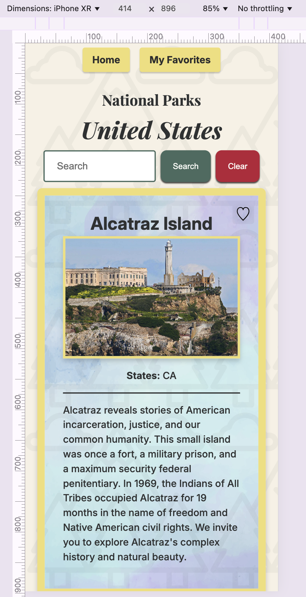

# ACS 4330 Query Languages Final Project

- Project utilizes GraphQL, Node, React, Apollo, and the National [Park Service API](<(https://www.nps.gov/subjects/developer/api-documentation.htm#/)>)
- Assignment details on [class page](https://github.com/Tech-at-DU/ACS-4330-Query-Languages/blob/master/Assignments/FinalProjectSpec.md)

## Types

Types include `Park`, `Images`, `Activity`, `Address` and `ParksResponse`

## Relationship

- The `images` field in the `Park` type is an array of `Images` objects. The first image in the array is shown on each park card in the UI.
- The `activities` field in the `Park` type is an array of `Activity` objects. This is not exposed in the UI, but can be queried in Apollo GraphQL after starting the server.
- The `addresses` field in the `Park` type is an array of `Address` objects. This is not exposed in the UI, but can be queried in Apollo GraphQL after starting the server.
- The `data` field in the `ParksResponse` is an array of `Park` objects. This data is fetched to populate the park information in the UI of the React app.

## Responsive and mobile-friendly

Widescreen:

Mobile:

## How to Run Locally

Navigate to relevant directory (open two separate terminals):
`cd client` or `cd server`

Install node modules:
`npm install`

Start the development server:
`npm run dev`

View Apollo GraphQL :
[http://localhost:4000/graphql?](http://localhost:4000/graphql?)

## Resources

### React + TypeScript + Vite

This template provides a minimal setup to get React working in Vite with HMR and some ESLint rules.

Follow directions to [scaffold your first vite project](https://vite.dev/guide/#scaffolding-your-first-vite-project)

Make sure you're using Node.js version 18+ or 20+.
