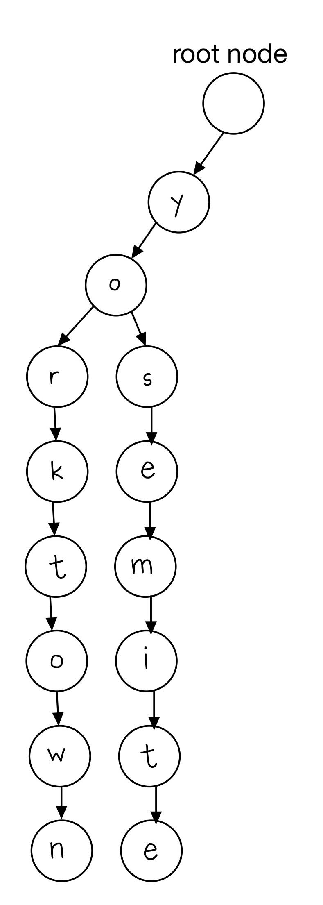
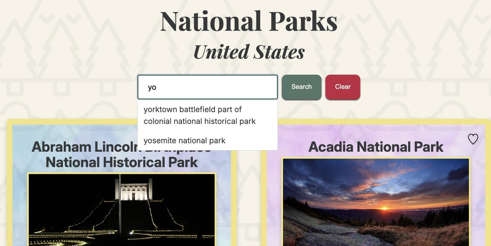

# Efficient Autocomplete Search for National Parks

The National Parks Services API project is a single page application where users can search for and add parks to a favorites list.

## The Problem

Originally, in the naive search function, the server fetched all parks (almost 500) from the NPS API and [filtered](https://developer.mozilla.org/en-US/docs/Web/JavaScript/Reference/Global_Objects/Array/filter) for each search request. This means that each search request had a time complexity of **O(n \* m)** where **n** is the number of parks and **m** is the average length of the park name. We were always going through every park for every search.

To improve the search, I implemented a prefix tree autocomplete.

## What is a Prefix Tree?

A prefix tree is a tree data structure where each node stores a single character. We call it a "trie" because it comes from the word "retrieval" but pronounce it as "try" to distinguish it from other "tree" data structures. A trie has an empty root note and child nodes pointing back to it. The number of child nodes is associated with the number of possible alphabetic values. The next levels are again possible alphabetic values. These are connected together as linked lists.

We can retrieve words and strings from the structure by "traversing down a branch path of the tree" ([Joshi, V.](https://medium.com/basecs/trying-to-understand-tries-3ec6bede0014)). That is, strings are stored as paths from the root to terminal nodes as linked lists. For example, "yorktown" and "yosemite" share the same path for "y" and "o" before branching apart, since they share the same prefix "yo".

To find all parks starting with a prefix like "yo", you walk down the tree following y -> o, then collect every string in the subtree below. We don't look at parks starting with other letters, which makes a trie great for autocomplete. We can jump to the relevant branch and only visit matches instead of having to check each park.



## What I Built

1. To implement autocomplete in search, I ported the prefix tree code from Python to JavaScript. This was more straightforward than I expected, mainly mapping the syntax over. For example, needed to use `this` instead of `self`, `throw new Error` instead of `raise ValueError`, and `.length` instead of `len()`. I was able to re-use the logic.

The key method is `complete(prefix)`, which returns a list of all strings starting with a given prefix.

<table><thead>
<tr>
<th>Python</th>
<th>JavaScript</th>
</tr></thead>
<tr>
<td>
    
```python

    def complete(self, prefix) -> list[str]:
        completions = []
        node, depth = self._find_node(prefix)
        if depth != len(prefix):
            return completions

        def visit(node, path):
            if node.is_terminal():
                completions.append(path)
        self._traverse(node, prefix, visit)
        return completions

````
</td>
<td>

```js
  complete(prefix) {
    const completions = [];
    const [node, depth] = this._findNode(prefix);

    if (depth !== prefix.length) {
      return completions;
    }

    const visit = (node, path) => {
      if (node.isTerminal()) {
        completions.push(path);
      }
    };

    this._traverse(node, prefix, visit);
    return completions;
  }
````

</td>
</tr>
</table>

2. On the server side, I created a module (`park-trie.js`) that fetches all park names from the NPS API once at startup and inserts them into a trie. This project already used GraphQL as a layer between the NPS API and the React frontend to simplify querying by the client. I added an `autocomplete` query to the schema and a resolver that calls `parkTrie.complete(prefix)` to return matching park names.

```park-tries.js
const parkTrie = new PrefixTree();

async function loadParks() {
  const apiData = await npsApiClient.fetchParks(0, 500);

  for (const park of apiData.data) {
    parkTrie.insert(park.fullName.toLowerCase());
  }
}
```

3. Lastly, in the client, I created a corresponding `autocomplete` GraphQL query and used [Apollo\'s](https://www.apollographql.com/docs/react/api/react/useLazyQuery) `useLazyQuery` to call autocomplete as the user types in the SearchBar. Each keystroke sends the current input as a prefix and the matching park names appear in a dropdown menu below the search. Clicking on a suggestion takes a user to the selected park.



## Why this is better

<table><thead>
  <tr>
    <th>Before (naive)</th>
    <th>After (prefix trie)</th>
  </tr></thead>
<tbody>
  <tr>
    <td>Fetch all parks with each search</td>
    <td>Only fetch all parks once at start up</td>
  </tr>
  <tr>
    <td>Time complexity of O(n * m) where n is the number of parks and m is the average length of the park name. Goes through each park name on every search. <br></td>
    <td>Time complexity of O(k + c) where k is the prefix length and c is the number of matches. Lookup time doesn't depend on the total number of parks because we walk the prefix path directly and only visit the matches.  <br></td>
  </tr>
  <tr>
  <td>No suggestions while typing<br></td>
  <td>Live suggestions from autocomplete while user types<br></td>
  </tr>
</tbody>
</table>

## What I learned

### References

1. [Array.filter](https://developer.mozilla.org/en-US/docs/Web/JavaScript/Reference/Global_Objects/Array/filter) from MDN docs
2. [Trying to Understand Tries](https://medium.com/basecs/trying-to-understand-tries-3ec6bede0014) by Vaidehi Joshi
3. [useLazyQuery](https://www.apollographql.com/docs/react/api/react/useLazyQuery) from Apollo GraphQL docs
